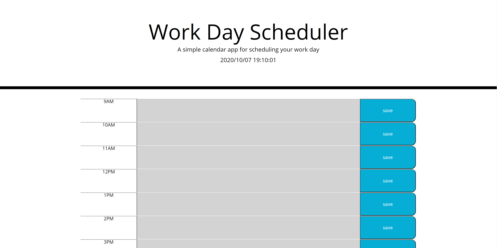

## Work Day Scheduler

## Purpose
To provide a daily work schedule planner that A: stores user input into the planner and B: alerts user to current time on the planner.

## Method
The planner uses dynamic population using arrays to populate rows with buttons, text areas, and time slots for the user to review/input their data into said planner. The planner then saves data on click function into the local storage. The planner tests the value of the hours column against the current hour to change the color of the planner to alert user of current time and future time using ifs and else ifs.
## End result

 </img>
